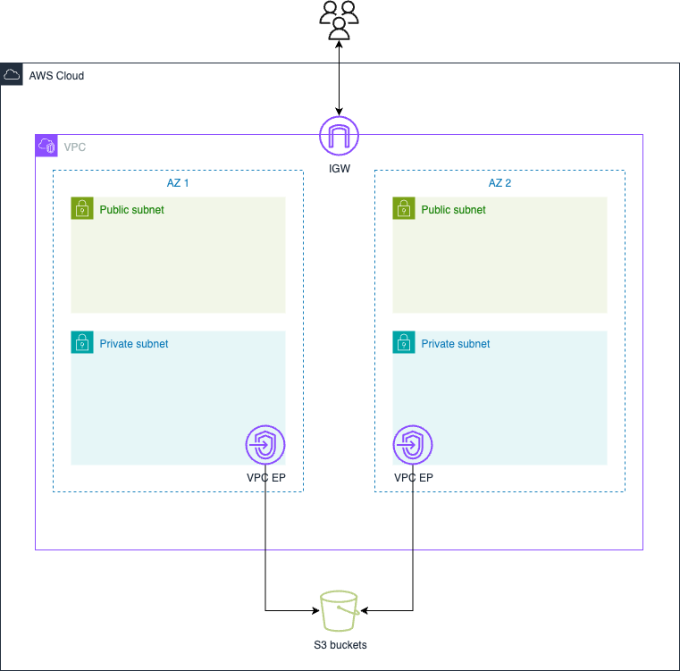

# Base Infrastructure
- Base infrastructure configurations
- VPC `default`
    - 2 public subnets
    - 2 private subnets
    - no NAT gateway
- Private DNS Zone `demo.ansolute.com`
    - associated with `default` VPC
- S3 VPC Endpoint for private subnets
- S3 Policy
    - RW for ytensor42-common/config/*
- Instance Roles
    - `instance-profile-ssm-ecr`
        - arn:aws:iam::aws:policy/AmazonSSMManagedInstanceCore
        - arn:aws:iam::aws:policy/EC2InstanceProfileForImageBuilderECRContainerBuilds
        - S3 Policy arn for base configuration
    - `instance-profile-ssm`
        - arn:aws:iam::aws:policy/AmazonSSMManagedInstanceCore
        - S3 Policy arn for base configuration
- Diagram
    