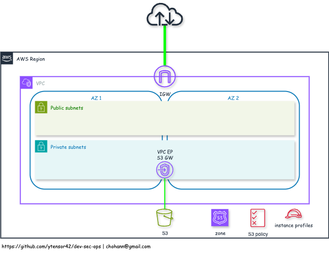

# Base Infrastructure

## `default` VPC

- Base VPC for further infrastructures
    - infra: `infra/aws/base/vpc`

- VPC `default`
    - 2 public subnets
    - 2 private subnets
    - no NAT gateway

- Public DNS Zone `demos.aws.ansolute.com`
    - associated with `default` VPC

- S3 VPC Endpoint (gateway) for private subnets

- S3 Policy
    - RW for `ytensor42-common/config/*`
        - files storage for resource configurations

- Instance Roles
    - `instance-profile-ssm-ecr`
        - `arn:aws:iam::aws:policy/AmazonSSMManagedInstanceCore`
        - `arn:aws:iam::aws:policy/EC2InstanceProfileForImageBuilderECRContainerBuilds`
        - S3 Policy ARN for base configuration
    - `instance-profile-ssm`
        - `arn:aws:iam::aws:policy/AmazonSSMManagedInstanceCore`
        - S3 Policy ARN for base configuration

- Diagram

    

---
## NAT Gateway

- Adding NAT Gateway for `default` VPC
    - infra: `infra/aws/base/natgw`

- Single / Multiple NAT GW for private subnets

- Outgoing route for each private subnet

---
## SSM VPC Endpoint

- Adding SSM VPC Endpoint (`interface` type)
    - infra: `infra/aws/base/ssm-ep`
- Service names
    - com.amazonaws.<var.region>.ssm
    - com.amazonaws.<var.region>.ssmmessages
    - com.amazonaws.<var.region>.ec2messages

---
## ECR VPC Endpoint

- Adding ECR VPC Endpoint (`interface` type)
    - infra: `infra/aws/base/ecr-ep`
- Service names
    - com.amazonaws.<var.region>.ecr.api
    - com.amazonaws.<var.region>.ecr.dkr
