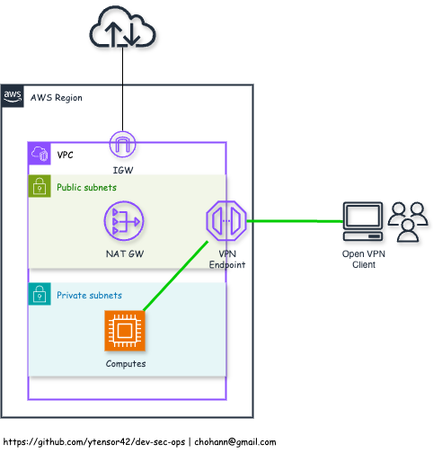

# AWS VPN Client

## Description
  - AWS Client VPN is a fully managed, scalable, and secure VPN service that enables remote users (e.g., developers, administrators, contractors) to securely connect to AWS resources and on-premises networks using the OpenVPN protocol
  - It eliminates the need to provision and manage traditional VPN infrastructure

### Diagram

  

### Features
  - Fully managed by AWS — no need to deploy or manage VPN servers
  - OpenVPN-based — compatible with standard OpenVPN clients (Windows, macOS, Linux)
  - Authentication options — mutual TLS, SAML 2.0, and Active Directory integration
  - Split-tunnel or full-tunnel support — control traffic routing per use case
  - Access to AWS and on-premises networks — integrate with TGW/VGW/Site-to-Site VPN
  - Highly available and elastic — automatically scales to handle more connections
  - Fine-grained access control — based on CIDR blocks and security groups
  - CloudWatch logging — connection logs for audit and monitoring

### Common Use Cases
  - Secure remote access to AWS resources for remote workers or contractors
  - VPC access for developers and operators without using bastion hosts
  - Hybrid network access — connect to both AWS and on-premises environments
  - Zero trust or identity-based security models for internal applications
  - Multi-region or global team access with centralized VPN management

### Limitations
  - No support for UDP-based applications other than OpenVPN (e.g., VoIP, some real-time apps)
  - No direct peering with VPC endpoints (must configure routing manually)
  - AWS Client VPN does not support IPv6 — only IPv4 traffic is allowed
  - Not available in all AWS Regions — regional availability may vary
  - Limited protocol support — only OpenVPN (SSL/TLS); no IPSec/IKEv2
  - Limited bandwidth per client — suitable for typical admin/dev use, not high-throughput needs
  - Split-tunnel is optional — but full-tunnel routing requires manual setup and care
  - No native support for device posture checks (e.g., device health, antivirus status)
  - Client configuration file management must be handled manually (unless SAML is used)
  - SAML auth requires additional IdP setup — adds complexity for federated access
  - Per-user logging granularity may be limited without CloudWatch + custom log processing
  - Pricing is per connection-hour — can become expensive for large, always-on deployments

<hr>

## VPN Certificates

#### EasyRSA setup

  ```
  git clone https://github.com/OpenVPN/easy-rsa.git
  cd easy-rsa/easyrsa3
  ./easyrsa init-pki
  ```

  - This creates a new PKI (Public Key Infrastructure) directory.
  - The working directory will contain certificate files.

#### Build CA (Certificate Authority)

  ```
  ./easyrsa build-ca nopass
  ```

  - This generates the CA private key and root certificate
  - Files created:
    - `pki/ca.crt` — Root CA certificate
    - `pki/private/ca.key` — Root CA private key (unencrypted)

#### Generate the Server Certificate (for AWS VPN server)

  ```
  ./easyrsa build-server-full server nopass
  ```

  - This signs the server certificate using the root CA
  - Files created:
    - `pki/issued/server.crt` — Server certificate
    - `pki/private/server.key` — Server private key (unencrypted)

#### Prepare Files for AWS ACM Import (Server Side)

  - `server_certificate_arn`
    - `server.crt` — Certificate
    - `server.key` — Private key (must be unencrypted)
    - `ca.crt` — Certificate chain (root CA)
      ```
      aws acm import-certificate \
        --certificate fileb://pki/issued/server.crt \
        --private-key fileb://pki/private/server.key \
        --certificate-chain fileb://pki/ca.crt \
        --region <aws-region>
      ```

  - `root_certificate_chain_arn`
    - `ca.crt` — Certificate chain (root CA)
    - `private/ca.key` — dummy key to pass acm import
      ```
      aws acm import-certificate \
        --certificate fileb://pki/ca.crt \
        --private-key fileb://pki/private/ca.key \
        --region <aws-region>
      ```

#### Client Certificate (for VPN client)

  ```
  ./easyrsa build-client-full client1 nopass
  ```

  - This signs the client certificate using the same CA
  - Files created:
    - `pki/issued/client1.crt` — Client certificate
    - `pki/private/client1.key` — Client private key (unencrypted)
  - Provide `client1.crt`, `client1.key`, and `ca.crt` to users in `.ovpn` configuration

<hr>

## OpenVPN client

#### MacOS
- Tunnelblick (Free, GUI-based)
  - Download from the official website: https://tunnelblick.net/downloads.html
  - Open the `.dmg` and move Tunnelblick to the Applications folder
  - Launch Tunnelblick and approve any permission prompts (may need admin access)
- CLI-based
  ```
  brew install openvpn
  ```

#### Ubuntu / Debian
  ```
  sudo apt update
  sudo apt install openvpn -y
  ```

#### RHEL / CentOS / AlmaLinux
  ```
  sudo yum install epel-release -y
  sudo yum install openvpn -y
  ```

#### Windows
- Official site: https://openvpn.net/community-downloads/
- Download and install the Windows Installer version

#### Configuration
- Place `client.crt`, `client.key`, `ca.crt` in same directory and create `client.ovpn` file
  - Windows : `C:\Program Files\OpenVPN\config\`
  - Store files securely (never commit to Git!)
  - Restrict file permissions:
    ```
    chmod 600 *.crt *.key *.ovpn
    ```
- Connect
  ```
  cd <vpn-config-folder>
  sudo openvpn --config client.ovpn
  ```
- Sample `client.ovpn` file (*configure `remote` and other parameters properly*)
  ```
  client
  dev tun
  proto udp
  remote vpn.example.com 1194
  resolv-retry infinite
  nobind
  persist-key
  persist-tun
  remote-cert-tls server

  ca ca.crt
  cert client.crt
  key client.key

  cipher AES-256-CBC
  auth SHA256
  comp-lzo
  verb 3
  ```

