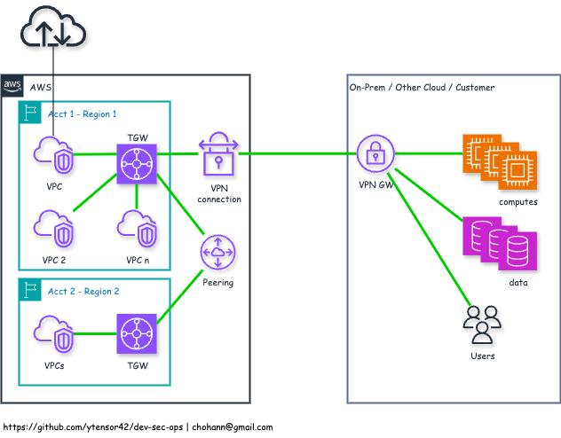

# AWS VPN using Transit Gateway

- Description
  - AWS Transit Gateway (TGW) is a highly scalable, cloud-native hub that connects multiple VPCs, VPNs, and AWS Direct Connect links through a central gateway
  - A VPN connection to a Transit Gateway enables encrypted Site-to-Site IPsec connectivity between on-premises networks and AWS, with the TGW acting as the central router for all attached networks

- Features
  - Hub-and-spoke architecture — connects multiple VPCs and on-prem networks via one gateway
  - Supports Site-to-Site IPsec VPN (2 tunnels per VPN connection for HA)
  - Scales to thousands of VPCs and attachments
  - Attachment-based routing — enables segmented routing domains (route tables per attachment)
  - BGP (dynamic) or static routing support
  - Integration with AWS Direct Connect, VGW, and Client VPN
  - Cross-account and cross-region VPC connectivity via attachments and peering
  - Built-in high availability across multiple AZs

- Common Use Cases

  - Large-scale enterprise networks with dozens or hundreds of VPCs
  - Centralized hybrid connectivity (on-premises ↔ multiple VPCs)
  - Simplifying VPC-to-VPC peering by using TGW as a central router
  - Multi-region network architectures (via TGW peering)
  - Migration and failover between environments (e.g., prod/stage/dev)
  - Enabling segmentation and network isolation with multiple TGW route tables

- Limitations

  - Higher cost compared to VGW or VPC peering (charged per attachment and data)
  - VPN throughput is limited (~1.25 Gbps per tunnel) — same as VGW
  - No SSL/TLS VPN support — only IPsec IKEv1/IKEv2
  - Requires separate setup for DNS resolution between attached networks
  - TGW is a regional resource — cross-region requires TGW peering
  - Requires careful routing table design — complexity increases with scale
  - Attachment propagation doesn't imply automatic access — must configure routes explicitly
  - AWS Transit Gateway Connect (for SD-WAN) is a separate feature and adds cost

- Diagram

  
