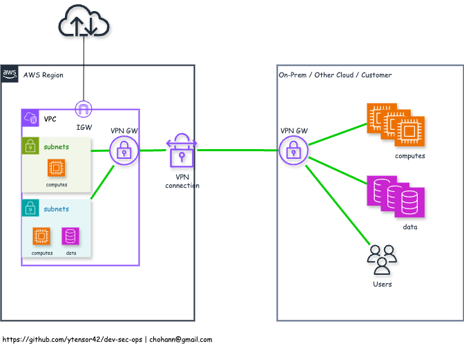

# AWS VPN using Virtual Private Gateway

- Description
  - A Virtual Private Gateway (VGW) is an AWS-managed VPN endpoint attached to a VPC that enables connectivity between AWS and an on-premises network using IPSec Site-to-Site VPN
  - It is often paired with a Customer Gateway (CGW) device on the customer’s side and supports encrypted traffic over the public internet

- Features

  - IPSec Site-to-Site VPN support — secure encrypted tunnels over the internet
  - Redundant tunnels (2 per VPN connection) for high availability
  - Integration with VGW, Direct Connect, or Transit Gateway
  - Static or BGP-based dynamic routing (supports route propagation to VPC route tables)
  - Quick setup — no need to deploy customer hardware inside AWS
  - Compatible with a wide range of on-premises devices (Cisco, Fortinet, pfSense, etc.)
  - Supports multiple VPN connections to a single VGW

- Common Use Cases

  - Hybrid cloud architectures — extend an on-premises network into AWS
  - Disaster recovery or backup connectivity between datacenter and cloud
  - Secure tunneling of sensitive enterprise workloads to AWS
  - Allowing legacy systems to connect with AWS-hosted services
  - Failover path for AWS Direct Connect (VGW-based VPN used as backup)

- Limitations

  - Only supports IP-based communication (no multicast)
  - Throughput is limited (~1.25 Gbps per tunnel) — may be lower depending on latency
  - No SSL-based VPN — only supports IPsec/IKEv1 or IKEv2
  - Cannot terminate client VPN sessions — only site-to-site VPNs supported
  - No fine-grained user-level access control — VPN is network-level only
  - Limited to one VGW per VPC (unless using Transit Gateway)
  - High availability depends on customer gateway redundancy
  - Requires public IP on customer gateway side (or static CGW config)
  - Not ideal for dynamic endpoint IPs — best with static or predictable IPs

- Diagram

  
