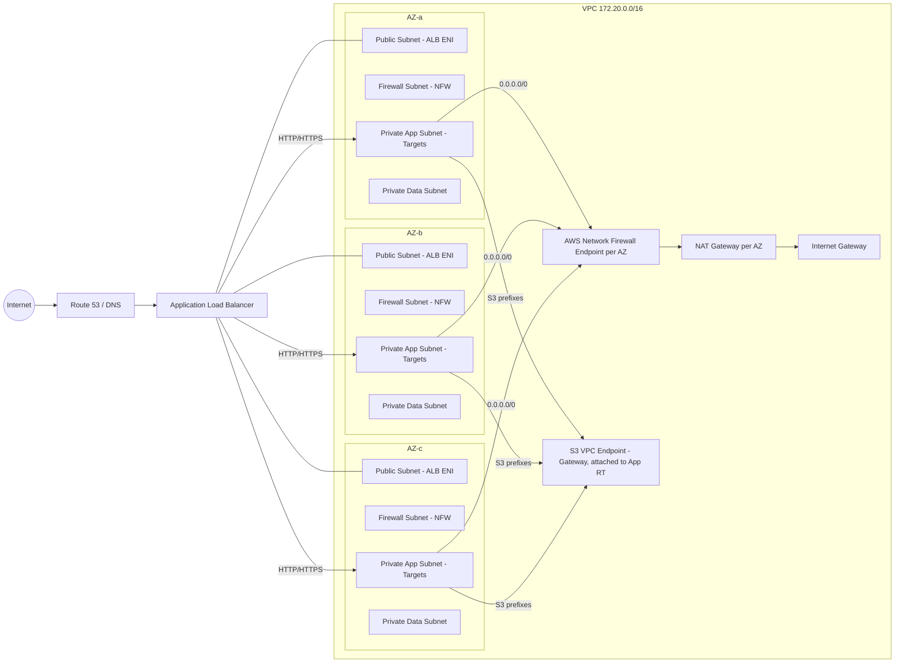
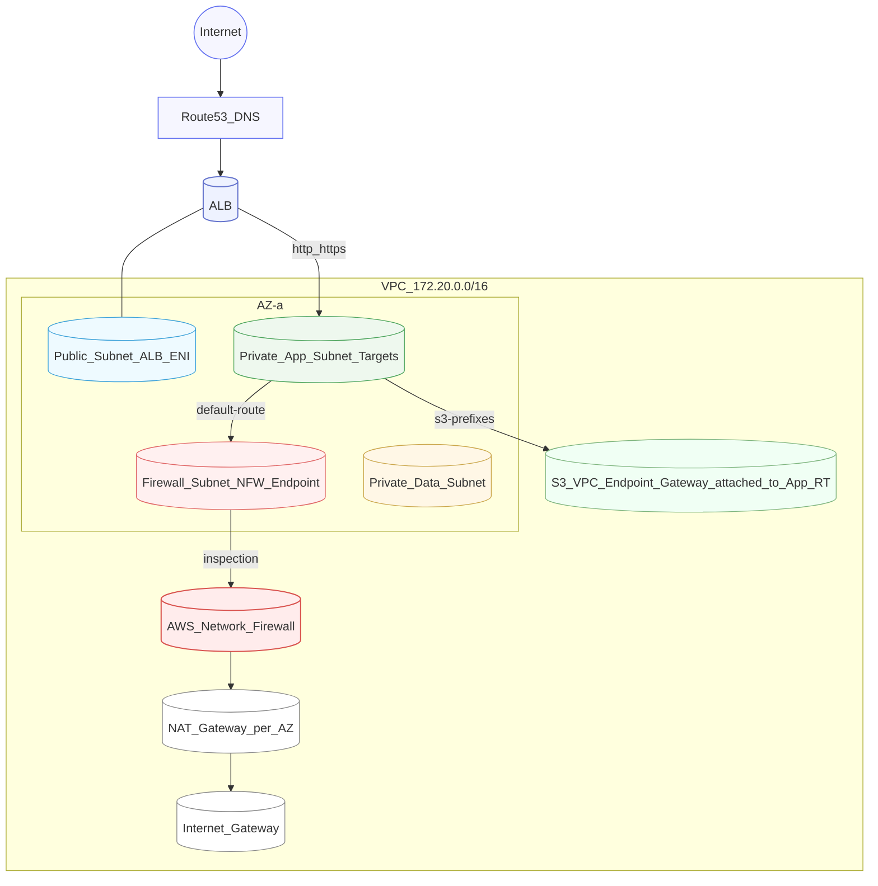

## VPC Diagram


### VPC



### VPC with FW (in/e)gress



### Ingress + Egress Inspection VPC

```mermaid
flowchart LR
  Internet((Internet)) --> IGW --> IngressVPC[NFW Ingress Inspection VPC] --> TGW
  TGW --> AppVPC[App VPC (ALB, App, Data)]
  AppVPC --> TGW --> EgressVPC[NFW Egress Inspection VPC] --> NATGW --> IGW
```