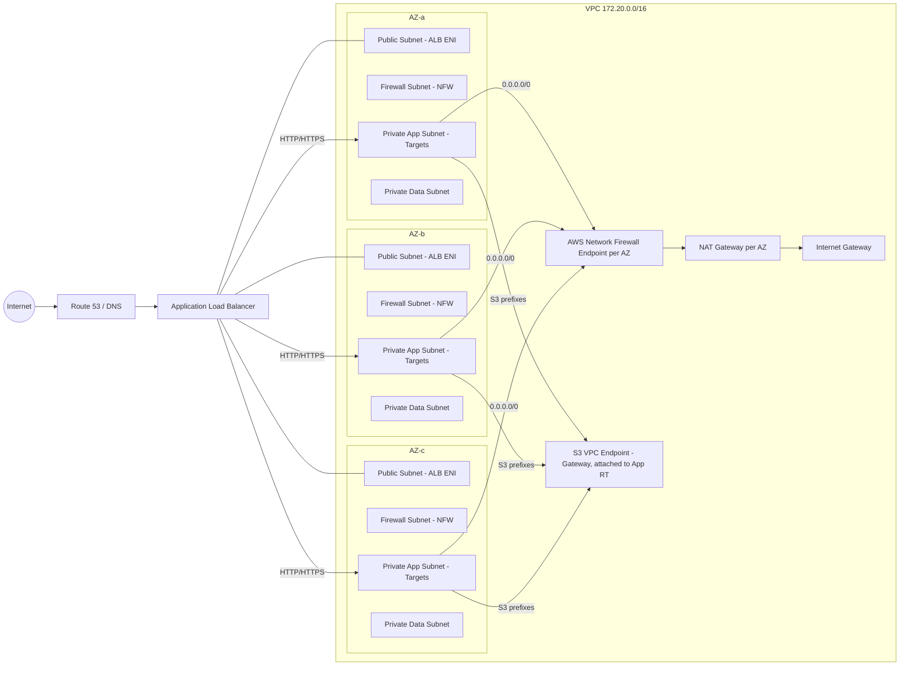

## VPC Diagram

```mermaid
flowchart LR
  Internet((Internet)) --> R53[Route 53 / DNS]
  R53 --> ALB[Application Load Balancer]

  subgraph VPC[ VPC 172.20.0.0/16 ]
    direction LR

    subgraph AZa[AZ-a]
      direction TB
      PUBa[Public Subnet - ALB ENI]
      FWa[Firewall Subnet - NFW]
      APPa[Private App Subnet - Targets]
      DATAa[Private Data Subnet]
    end

    subgraph AZb[AZ-b]
      direction TB
      PUBb[Public Subnet - ALB ENI]
      FWb[Firewall Subnet - NFW]
      APPb[Private App Subnet - Targets]
      DATAb[Private Data Subnet]
    end

    subgraph AZc[AZ-c]
      direction TB
      PUBc[Public Subnet - ALB ENI]
      FWc[Firewall Subnet - NFW]
      APPc[Private App Subnet - Targets]
      DATAc[Private Data Subnet]
    end

    NAT[NAT Gateway per AZ]
    IGW[Internet Gateway]
    NFW[AWS Network Firewall Endpoint per AZ]
    S3EP[S3 VPC Endpoint - Gateway, attached to App RT]
  end

  %% ALB ENIs live in Public subnets (conceptual link)
  ALB --- PUBa
  ALB --- PUBb
  ALB --- PUBc

  %% Ingress: ALB -> App Targets (Target Group)
  ALB -->|HTTP/HTTPS| APPa
  ALB -->|HTTP/HTTPS| APPb
  ALB -->|HTTP/HTTPS| APPc

  %% Default egress path
  APPa -->|0.0.0.0/0| NFW --> NAT --> IGW
  APPb -->|0.0.0.0/0| NFW
  APPc -->|0.0.0.0/0| NFW

  %% S3 route (Gateway endpoint via App RT association)
  APPa -->|S3 prefixes| S3EP
  APPb -->|S3 prefixes| S3EP
  APPc -->|S3 prefixes| S3EP

```