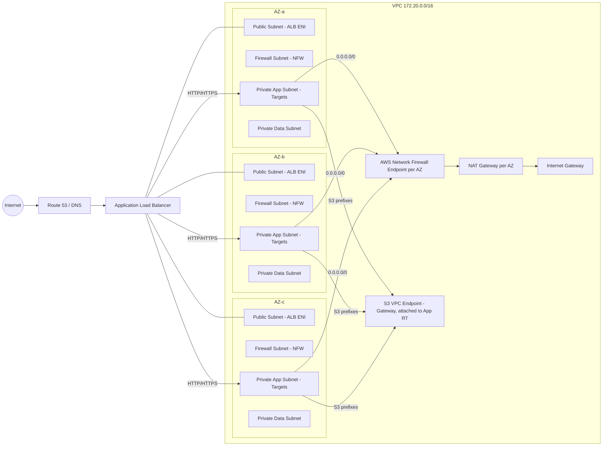

## VPC Diagram


### VPC


### VPC with FW (in/e)gress
```
flowchart TB
  Internet((Internet)):::ext --> R53[Route 53 / DNS]:::ext
  R53 --> ALB[(Application Load Balancer)]:::lb

  subgraph VPC[ VPC 172.20.0.0/16 ]
    direction LR

    subgraph AZa[AZ-a]
      direction TB
      PUBa[(Public Subnet\nALB ENI)]:::pub
      FWa[(Firewall Subnet\nNFW Endpoint)]:::fw
      APPa[(Private App Subnet\nTargets)]:::app
      DATAa[(Private Data Subnet)]:::data
    end

    NAT[(NAT Gateway per AZ)]:::nat
    IGW[(Internet Gateway)]:::igw
    S3EP[(S3 VPC Endpoint - Gateway\nAttached to App Route Table)]:::s3
    NFW[(AWS Network Firewall)]:::fwcore
  end

  %% Ingress path
  Internet --> R53 --> ALB
  ALB -->|HTTP/HTTPS| PUBa
  ALB -->|Target Group| APPa

  %% App Egress via Firewall Subnet
  APPa -->|0.0.0.0/0 (default route)| FWa
  FWa -->|Inspection + Allow| NFW
  NFW -->|Egress traffic| NAT --> IGW

  %% S3 Endpoint (bypass NFW/NAT)
  APPa -->|S3 Prefixes| S3EP

  %% (optional future) ingress inspection
  IGW -->|Ingress inspection (optional)| NFW --> FWa --> ALB

  classDef ext fill:#f6f6ff,stroke:#6270f0,stroke-width:1.2;
  classDef pub fill:#eefaff,stroke:#3aa0d8;
  classDef app fill:#eef8ee,stroke:#4aa35a;
  classDef data fill:#fff7e6,stroke:#caa64a;
  classDef fw fill:#fff0f0,stroke:#e06666;
  classDef fwcore fill:#ffecec,stroke:#d9534f,stroke-width:1.5;
  classDef nat fill:#fff,stroke:#888;
  classDef igw fill:#fff,stroke:#888;
  classDef s3 fill:#f0fff4,stroke:#7db47d;
  classDef lb fill:#eef2ff,stroke:#6574cd,stroke-width:1.5;
```